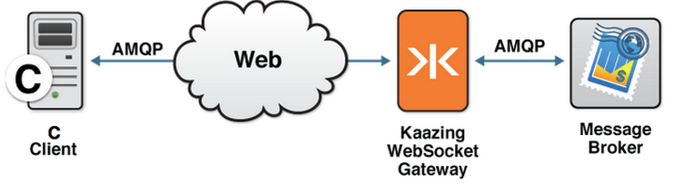

-   [Home](../../index.md)
-   [Documentation](../index.md)
-   Build C AMQP Clients

Build C AMQP Clients  
=======================================

This checklist provides the steps necessary to build AMQP clients to communicate with KAAZING Gateway:

| \#  | Step                                                                                                                     | Topic or Reference                                                                             |
|-----|--------------------------------------------------------------------------------------------------------------------------|------------------------------------------------------------------------------------------------|
| 1   | Learn about the KAAZING Gateway C AMQP client.                                                                      | [Overview of the KAAZING Gateway C AMQP Client Library](#keglibs)                         |
| 2   | Learn how to use the Gateway C Client Library and the supported APIs.                                                 | [Use the KAAZING Gateway C AMQP Client Library](p_dev_c_client_amqp.md)                 |
| 3   | Learn how to establish trust between your C client and the Gateway by using client-side TLS/SSL digital certificates. | [Require Clients to Provide Certificates to the Gateway](../security/p_tls_mutualauth.md) |

Overview of AMQP 0-9-1
-----------------------------------------------------

Advanced Message Queuing Protocol (AMQP) is an open standard for messaging middleware that was originally designed by the financial services industry to provide an interoperable protocol for managing the flow of enterprise messages. To guarantee messaging interoperability, AMQP 0-9-1 defines both a wire-level protocol and a model—the AMQP Model—of messaging capabilities.

The AMQP Model defines three main components:

1.  *Exchange*: clients publish messages to an exchange
2.  *Queue*: clients read messages from a queue
3.  *Binding*: a mapping from an exchange to a queue

An AMQP client connects to an AMQP broker and opens a *channel*. Once the channel is established, the client can send messages to an exchange and receive messages from a queue. To learn more about AMQP functionality, take a look at the [Real-Time Interactive Guide to AMQP](../guide-amqp.md), an interactive guide that takes you step-by-step through the main features of AMQP version 0-9-1.

For more information about AMQP, visit <http://www.amqp.org>.

WebSocket and AMQP
------------------

KAAZING Gateway enables direct WebSocket communication from the AMQP client to the Gateway and then onto an AMQP broker over TCP. The Gateway radically simplifies C application design by providing the AMQP client libraries for C client technologies.

Using the AMQP client libraries, you can take advantage of the AMQP features, making the C client a first-class citizen in AMQP systems.

Overview of the KAAZING Gateway C AMQP Client Library
-----------------------------------------------------

KAAZING Gateway includes AMQP client libraries that allow clients to subscribe and publish messages to a message broker using AMQP. With the KAAZING Gateway AMQP client libraries, you can leverage WebSocket in your C client. This WebSocket-enabled C client then communicates between your application and the message broker, as shown in the following figure:

**Figure: KAAZING Gateway C AMQP Client Connection**

Starting an AMQP Broker
-----------------------

There are a wide variety of AMQP brokers available that implement different AMQP versions. For example, RabbitMQ, Apache Qpid, OpenAMQ, Red Hat Enterprise MRG, UMQ, and Zyre. If you do not have an AMQP broker installed yet, you can use the Apache Qpid AMQP broker included in the Gateway download package, that supports AMQP version 0-9-1.

To set up and start the Apache Qpid broker on your system, perform the steps described in [Setting Up KAAZING Gateway](../about/setup-guide.md).

**Note**: The AMQP client libraries are compatible with AMQP version 0-9-1. Refer your AMQP broker documentation for information about certified AMQP versions.

For information on integrating with RabbitMQ, see [Integrate RabbitMQ Messaging](../integration-amqp/p_amqp_integrate_rabbitmq.md).

Taking a Look at the AMQP Demo Files
------------------------------------

Take a look at demonstration files built with the C version of the AMQP client library: `GATEWAY_HOME/demo/c/src/amqp`

Next Step
---------

[Use the KAAZING Gateway C AMQP Client Library](p_dev_c_client_amqp.md)
