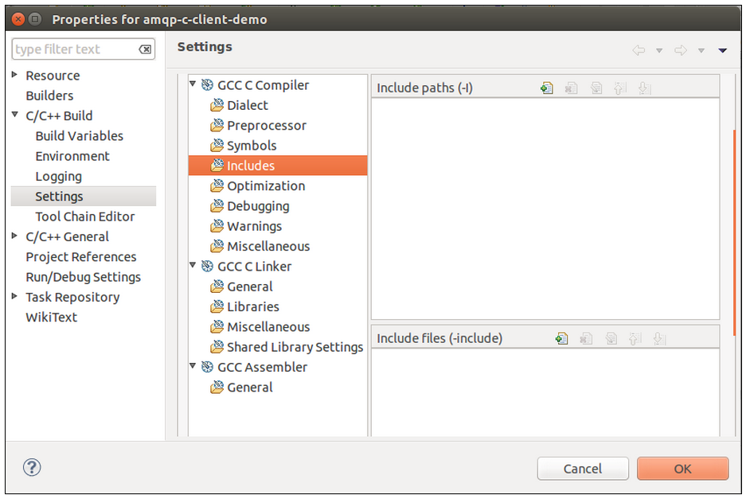
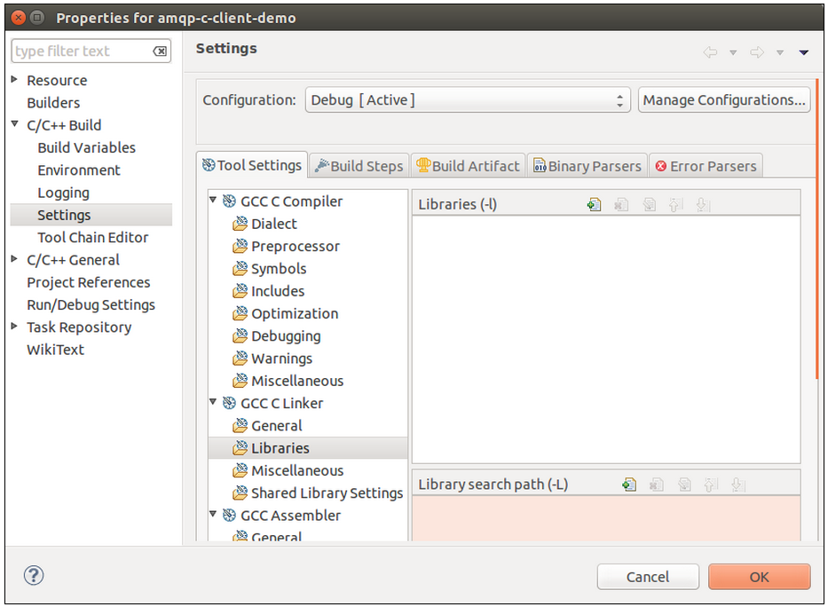
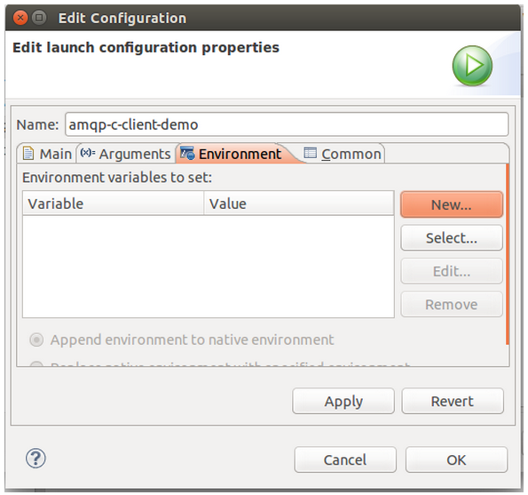
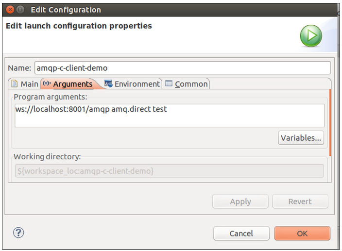

-   [Home](../../index.md)
-   [Documentation](../index.md)
-   Use the KAAZING Gateway C AMQP Client Library

Use the KAAZING Gateway C AMQP Client Library  
=====================================================================

In this procedure, you will learn how to use the KAAZING Gateway C AMQP Client Library and the supported APIs:

-   Build the client using the Eclipse IDE as described in [To Use the KAAZING Gateway C AMQP Client Library](#proc).
-   See examples for producing and consuming messages, including OpenSSL: [Examples](#examples).

Before You Begin
--------------------------------

This procedure is part of [Build C AMQP Clients](o_dev_c_amqp.md):

1.  [Overview of the KAAZING Gateway AMQP Client Library](o_dev_c_amqp.md#keglibs)
2.  **Use the KAAZING Gateway C AMQP Client Library**
3.  [Require Clients to Provide Certificates to the Gateway](../security/p_tls_mutualauth.md)

Components and Tools
--------------------

Before you get started, review the components and tools used to build the AMQP C client in this procedure. The AMQP broker used in this procedure can be switched with another broker that supports AMQP 0-9-1.

Component or Tool | Description | Location |
-------------------------------------------------------------------------------------- | --------------------------------------------------------------------------------------------------------------------------------------------------------------------------------------------------------------------------------------------------------------------------------------------------------------------------------------------------------------------------------------------------------------------------------------------------------------------------------------------------------------------- | ------------------------------------------------------------------------------------------------------------------------------------------------------------------------------------------------------------------------------------------------------------------------------------------------------------------------------------------------------------------------------------------------------------------------------------------------------------------------------------------------------------------------------------------------------------------------------------------------------------------------------------------------------ |
KAAZING Gateway | For a detailed description of the KAAZING Gateway, see http://kaazing.com/products/editions/kaazing-websocket-gateway-amqp. | http://developer.kaazing.com/downloads/amqp-edition-download/ |
AMQP broker | The full KAAZING Gateway download (Gateway + Documentation + Demos) includes the Apache Qpid broker. | Qpid\_HOME: The installer creates the default Qpid\_HOME destination in C:Files(Windows) or /usr/share/kaazing/amqp/version/ (Linux). The full KAAZING Gateway download contains the Apache Qpid broker folder in its root directory. |
KAAZING Gateway AMQP C Client library files | The C header files (.h) and the shared object files (.so) that make up the KAAZING Gateway AMQP C Client library. | The header and library files are contained in OS-specific gzip files located in GATEWAY\_HOME/lib/client/c. Extract the gzip file for your operating system to see the header and library files. AMQP header files (.h) and library (.so): GATEWAY\_HOME/lib/client/c/OS/AMQP-0-9-1/include GATEWAY\_HOME/lib/client/c/OS/AMQP-0-9-1/lib WebSocket header files (.h) and library (.so): GATEWAY\_HOME/lib/client/c/OS/WebSocket/include GATEWAY\_HOME/lib/client/c/OS/WebSocket/lib OS represents the files for your operating system. For some operating systems, there might be subfolders, such as: GATEWAY\_HOME/lib/client/c/Ubuntu-precise-64bit |
CDT (C/C++ Development Tooling) plugin for Eclipse or Eclipse IDE for C/C++ Developers | The Eclipse IDE is used to develop, compile, and test the AMQP C client. You have two options when configuring Eclipse: If you have an installed Eclipse package (for example, Eclipse for Java Developers), you can install the CDT plug-in as described here: http://www.eclipse.org/cdt/downloads.php. If you do not have an Eclipse package, you can download Eclipse IDE for C/C++ Developers from http://www.eclipse.org/downloads, and install the downloaded files. | Eclipse IDE for C/C++ Developers: http://www.eclipse.org/downloads/packages/eclipse-ide-cc-developers/keplersr2 CDT (C/C++ Development Tooling) plugin: http://www.eclipse.org/cdt/downloads.php |
Security with Challenge Handlers | Authenticating your C client involves implementing a challenge handler to respond to authentication challenges from the Gateway. If your challenge handler is responsible for obtaining user credentials, then you will also need to implement a login handler. | For examples, see amqp\_listen\_websocket.c and amqp\_sendstring\_websocket.c and look at the code: kaazing\_challenge\_handler\_t\* setup\_demo\_challenge\_handler() { return kaazing\_basic\_challenge\_handler\_new(&getcredential); } |
OpenSSL | OpenSSL is required by the C client to connect with the Gateway securely over TLS/SSL. See the OpenSSL examples: [amqp\_sendstring\_websocket\_ssl.c](#amqp_sendstring_websocket_sslc), and [amqp\_sendstring\_websocket\_ssl\_callback.c](#amqp_sendstring_websocket_ssl_callbackc). | OpenSSL is typically installed on most operating systems; however, if you are using a Linux distribution, you might need to install it. In most cases, you can simply update and upgrade your Linux distribution (sudo apt-get update && sudo apt-get upgrade), or install the OpenSSL development package (sudo apt-get install openssl libssl-dev). For more information, see http://www.openssl.org/support/faq.html and http://www.openssl.org/source/. |


To Use the KAAZING Gateway C AMQP Client Library
------------------------------------------------------------------------

Use the following steps to build and run an AMQP C client using the KAAZING Gateway AMQP C library.

1. Setting Up Your Development Environment.

  To develop applications using the KAAZING Gateway AMQP client libraries, you must configure the Gateway to communicate with an AMQP broker.

  **Note:** If you have the KAAZING Gateway running on `localhost` and if you have an AMQP broker running on `localhost` at the default AMQP port `5672`, you do not have to configure anything to see the AMQP demos and the interactive AMQP guide.

  The following is an example of the default configuration element for the AMQP service in the KAAZING Gateway bundle, as specified in the configuration file `GATEWAY_HOME/conf/gateway-config.xml`:

  ``` xml
  <!-- Proxy service to AMQP server -->
  <service>
    <accept>ws://localhost:8001/amqp</accept>
    <connect>tcp://localhost:5672</connect>

    <type>amqp.proxy</type>

    <cross-site-constraint>
      <allow-origin>http://localhost:8001</allow-origin>
    </cross-site-constraint>
  </service>
  ```

  In this case, the service is configured to accept WebSocket AMQP requests from the browser at `ws://localhost:8001/amqp` and proxy those requests to a locally installed AMQP broker (`localhost`) at port `5672`.

  To configure the Gateway to accept WebSocket requests at another URL or to connect to a different AMQP broker, you can edit `GATEWAY_HOME/conf/gateway-config.xml`, update the value for the `accept` and `connect` elements, and restart the Gateway. For example, the following configuration configures the Gateway to accept WebSocket AMQP requests at `ws://www.example.com:80/amqp` and proxy those requests to an AMQP broker (`amqp.example.com`) on port `5672`.

  ``` xml
  <!-- Proxy service to AMQP server -->
  <service>
          <accept>ws://www.example.com:80/amqp</accept>
          <connect>tcp://amqp.example.com:5672</connect>

        <type>amqp.proxy</type>
  </service>
  ```

2. Review the common C AMQP programming steps.

  You can either build a single application that both publishes and consumes messages, or create two different applications to handle each action. The demo located included in the KAAZING Gateway distrubtion shows a single application that handles both actions. You can view the source code for this demo in `GATEWAY_HOME/demo/c`. Refer to the AMQP Client C API documentation for the complete list of all the AMQP command and callback functions.

  The common C AMQP programming steps are:

  1.  Download, install and configure the Eclipse IDE.
  2.  Create an Eclipse C project.
  3.  Import AMQP C client libraries.
  4.  Create the source file for connecting to the AMQP broker via the Gateway and for consuming messages.
  5.  Create the source file for publishing.

3. Download and install the Eclipse IDE for C/C++ Developers. This topic uses the Kepler package of Eclipse.

  Download the Eclipse IDE for C/C++ Developers from here: [https://www.eclipse.org/downloads/packages/eclipse-ide-cc-developers/keplersr2](https://www.eclipse.org/downloads/packages/eclipse-ide-cc-developers/keplersr2)

  If you have an installed Eclipse package (for example, Eclipse for Java Developers), you can install the CDT plug-in as described here: <http://www.eclipse.org/cdt/downloads.php>

4. Create an Eclipse C project.

  1.  Launch Eclipse and select a workspace.
  2.  In the welcome screen, click the Workbench icon.
  3.  Right-click in the empty space in **Project Explorer**, click **New**, and then click **C Project**. The **C Project** dialog appears.
  4.  In **Project** name, enter **amqp-c-client-demo**.
  5.  In **Project** type, expand the **Executable** folder and select **Empty Project**.
  6.  In **Toolchains**, select the compiler for your OS platform.
  7.  Click **Finish**. The new project appears.

5. Add AMQP C header files.

  1.  Right-click the **amqp-c-client-demo** project in **Project Explorer** and click **Properties**.
  2.  In the **Properties** window, click **Settings** under the **C/C++ Build** heading.
  3.  In the **Settings** area, click **Tool Settings**.
  4.  Click **Includes** under the compiler heading, for example **GCC C Compiler** (this heading might be different depending on the compiler you selected when creating the project).

    

    **Figure: C Project Includes Compiler Heading**

  6.  In **Include paths**, click the **Add** icon. The **Add directory path** dialog appears.
  7.  Click **File System**, and then navigate to the KAAZING Gateway C header folders and click Open:

    `GATEWAY_HOME/lib/client/c/OS/AMQP-0-9-1/include`

    `GATEWAY_HOME/lib/client/c/OS/WebSocket/include`

  8.  Click **Apply**. The libraries appear in the project.

6. Add AMQP C shared object files.

  1.  In the **Properties** window for the project, click **Libraries** under the linker heading, for example, **GCC C Linker**.

    

    **Figure: C Project Libraries Settings**


  2.  In **Libraries**, click the **Add** icon. The **Enter Value** dialog appears.
  3.  Enter the name of the libraries, **websocket** and **rabbitmq**, and click **OK**.
  4.  In **Library search path**, click the **Add** icon. The **add directory path** dialog appears.
  5.  Click **File system**, navigate to the location of each of the library folders and click **OK**:

    `GATEWAY_HOME/lib/client/c/OS/AMQP-0-9-1/lib`

    `GATEWAY_HOME/lib/client/c/OS/WebSocket/lib`

  6.  Click **OK** to close the **add directory path** dialog.
  7.  Click **OK** to close the **Properties** window.

7. Create the source file for the client to consume and publish messages.

  1.  In **Project Explorer**, right-click **amqp-c-client-demo**, click **New**, and then click **Source File**.
  2.  In the **Source** file field, enter the name **amqp\_publish\_consume\_websocket.c**.
  3.  In **Template**, ensure that **Default C source template** is selected, and click **Finish**.

8. Add the C code in [amqp\_publish\_consume\_websocket.c](#publish_consume) to **amqp\_publish\_consume\_websocket.c**. The code will create a connection to the Gateway, open and bind to a channel with the AMQP broker and log in, publish and consume messages from the broker, and close the connection.

  **Note:** The example uses the files **utils.c** and **utils.h** located in the `GATEWAY_HOME/demo/c/src`. You should load those files into your project before building the project using the example files.

9. From the **File** menu, click **Save All**.

10. Build the Eclipse project.

  1.  Right-click the **amqp-c-client-demo** project, and then click **Build Project**.

11. Configure the launch configuration for the AMQP C client.

  1.  In the **Properties** window for the project, click the **Run/Debug Settings** heading.
  2.  Click **New**.
  3.  In the **Select Configuration Type** dialog, click **C/C++ Application**, and then click **OK**. The **Edit Configuration** window appears.

    

  **Figure: Environment Variables**

  4.  In the **Name** field, enter **amqp-c-client-demo**.
  5.  Click the **Environment** tab.
  6.  Click **New** to create a new variable. The **New Environment Variable** window appears.
  7.  In **Name**, enter **LD\_LIBRARY\_PATH**.
  8.  In **Value**, enter the paths to the shared object files (the two paths may be separated by a colon):

    `GATEWAY_HOME/lib/client/c/OS/AMQP-0-9-1/lib`

    `GATEWAY_HOME/lib/client/c/OS/WebSocket/lib`

  9.  Click **OK**.
  10. Click the **Arguments** tab.
  11. Enter the following argument: `ws://localhost:8001/amqp amq.direct test`

    

    **Figure: Program Arguments**

  12. Click **OK**.
  13. Click **OK** to close the **Properties** window.

12. Start the AMQP broker as described in **How do I start Apache Qpid?** in [Setting Up KAAZING Gateway](../about/setup-guide.md).

13. Start the Gateway as described in **How do I start and stop the Gateway?** in [Setting Up KAAZING Gateway](../about/setup-guide.md).

14. Run your AMQP C client program. In Eclipse, right-click the **amqp-c-client-demo** project, and click **Run**. The client will perform all of its functions in the Console.

Examples
--------

The following examples demonstrate how to:

1.  Import the libraries.
2.  Create the WebSocket connection to the Gateway.
3.  Connect and log into an AMQP broker.
4.  Create channels.
5.  Declare an exchange.
6.  Declare a queue.
7.  Bind an exchange to a queue.
8.  Consume messages.
9.  Publish messages.
10. Handle Exceptions.
11. Use OpenSSL with your C client.


Examples:

-   [amqp\_listen\_websocket.c](#amqp_listen_websocketc) - demonstrates how to consume AMQP messages.
-   [amqp\_sendstring\_websocket.c](#amqp_sendstring_websocketc) - demonstrates how to publish AMQP messages.
-   [amqp\_publish\_consume\_websocket.c](#amqp_publish_consume_websocketc) - demonstrates how to publish and consume AMQP messages on a single connection.
-   [amqp\_sendstring\_websocket\_ssl.c](#amqp_sendstring_websocket_sslc) - demonstrates how to publish AMQP messages and verify an OpenSSL client certificate against a Certificate Authority (CA).
-   [amqp\_sendstring\_websocket\_ssl\_callback.c](#amqp_sendstring_websocket_ssl_callbackc) - demonstrates how to publish AMQP messages and verify an OpenSSL client certificate against a local private key for client authentication.

**Note:** These examples use the files **utils.c** and **utils.h** located in the `GATEWAY_HOME/demo/c/src`. You should load those files into your project before building the project using one of these examples.
### <a name="listen"></a>amqp\_listen\_websocket.c

The following example demonstrates how to consume AMQP messages.

``` c
#include <stdlib.h>
#include <stdio.h>
#include <string.h>

#include <stdint.h>
#include <amqp_websocket.h>
#include <amqp.h>
#include <amqp_framing.h>

#include <assert.h>

#include "utils.h"

/* The callback function which is invoked when authorization or
   revalidation challenge is received from the gateway
*/
credential_t* getcredential(const char* challenge) {
        char buf[80];
        credential_t* credential = (credential_t*)malloc(sizeof(credential_t));
        puts("Enter username:");
        scanf("%s", buf);
        credential->username = strdup(buf);
        puts("Enter password:");
        scanf("%s", buf);
        credential->password = strdup(buf);
        return credential;
}

kaazing_challenge_handler_t* setup_demo_challenge_handler() {
        return kaazing_basic_challenge_handler_new(&getcredential);
}

int main(int argc, char const *const *argv)
{
  char const *url;
  int status;
  char const *exchange;
  char const *bindingkey;
  amqp_socket_t *socket = NULL;
  amqp_connection_state_t conn;

  amqp_bytes_t queuename;

  if (argc < 4) {
    fprintf(stderr, "Usage: amqp_listen_websocket url exchange bindingkey\n");
    fprintf(stderr, "Example: amqp_sendstring_websocket ws://localhost:8001/amqp amq.direct test\n");
    return 1;
  }

  url = argv[1];
  exchange = argv[2];
  bindingkey = argv[3];

  /* Initialize AMQP connection object */
  conn = amqp_new_connection();

  /*
   * Initialize underlying transport object
   * We are using WebSocket as a transport protocol for AMQP messaging
   */
  socket = amqp_websocket_new(conn);
  if (!socket) {
    die("creating WebSocket");
  }

  /* Setup challenge handler to respond to authorization and revalidation challenge */
  /* This should be done before establishing the WebSocket connection */
  /* First retrieve the websocket object */
  websocket_t *ws = amqp_websocket_get(socket);
  kaazing_challenge_handler_t* challengeHandler = setup_demo_challenge_handler();

  /* Inject challenge handler to the websocket object*/
  websocket_set_challenge_handler(ws, challengeHandler);

  /* Establish WebSocket connection */
  status = amqp_websocket_open(socket, url);
  if (status) {
    die("opening WebSocket connection");
  }

  /* Establish AMQP connection against the backend broker */
  die_on_amqp_error(amqp_login(conn, "/", 0, AMQP_DEFAULT_FRAME_SIZE, 0, AMQP_SASL_METHOD_PLAIN, "guest", "guest"),
                    "Logging in");

  /* Open Channel
   * To get the status of call to open channel, amqp_get_rpc_reply should be used
   * amqp_get_rpc_reply() returns the most recent amqp_rpc_reply_t instance corresponding
   * to such an API operation for the given connection.
   */
  amqp_channel_open(conn, 1);
  die_on_amqp_error(amqp_get_rpc_reply(conn), "Opening channel");

  {
        /* Declare Queue
         * In this case we are providing empty name that results in server creating a unique
         * queue name and sending it to the client
         */
    amqp_queue_declare_ok_t *r = amqp_queue_declare(conn, 1, amqp_empty_bytes, 0, 0, 0, 1,
                                 amqp_empty_table);
    die_on_amqp_error(amqp_get_rpc_reply(conn), "Declaring queue");

    /* Get the queue name sent by the server */
    queuename = amqp_bytes_malloc_dup(r->queue);
    if (queuename.bytes == NULL) {
      fprintf(stderr, "Out of memory while copying queue name");
      return 1;
    }
  }

  /* Bind queue to an exchange */
  amqp_queue_bind(conn, 1, queuename, amqp_cstring_bytes(exchange), amqp_cstring_bytes(bindingkey),
                  amqp_empty_table);
  die_on_amqp_error(amqp_get_rpc_reply(conn), "Binding queue");

  /* Start a queue consumer.
   * This method asks the server to start a "consumer", which is a transient request
   * for messages from a specific queue.
   */
  amqp_basic_consume(conn, 1, queuename, amqp_empty_bytes, 0, 1, 0, amqp_empty_table);
  die_on_amqp_error(amqp_get_rpc_reply(conn), "Consuming");

  {
    while (1) {
      amqp_rpc_reply_t res;
      amqp_envelope_t envelope;

      amqp_maybe_release_buffers(conn);

      /* Wait for and consume a message
       * The function waits for a basic.deliver method on any channel, upon receipt of
       * basic.deliver it reads that message, and returns.
       */
      res = amqp_consume_message(conn, &envelope, NULL, 0);

      if (AMQP_RESPONSE_NORMAL != res.reply_type) {
        break;
      }

      printf("Delivery %u, exchange %.*s routingkey %.*s\n",
             (unsigned) envelope.delivery_tag,
             (int) envelope.exchange.len, (char *) envelope.exchange.bytes,
             (int) envelope.routing_key.len, (char *) envelope.routing_key.bytes);

      if (envelope.message.properties._flags & AMQP_BASIC_CONTENT_TYPE_FLAG) {
        printf("Content-type: %.*s\n",
               (int) envelope.message.properties.content_type.len,
               (char *) envelope.message.properties.content_type.bytes);
      }

      printf("Message: %.*s\n",
                     (int) envelope.message.body.len,
                     (char *) envelope.message.body.bytes);

      amqp_destroy_envelope(&envelope);
    }
  }

  die_on_amqp_error(amqp_channel_close(conn, 1, AMQP_REPLY_SUCCESS), "Closing channel");
  die_on_amqp_error(amqp_connection_close(conn, AMQP_REPLY_SUCCESS), "Closing connection");
  die_on_error(amqp_destroy_connection(conn), "Ending connection");

  return 0;
}
```

### amqp\_sendstring\_websocket.c

The following example demonstrates how to publish AMQP messages.

``` c
#include <stdlib.h>
#include <stdio.h>
#include <string.h>

#include <stdint.h>
#include <amqp_websocket.h>
#include <amqp.h>
#include <amqp_framing.h>

#include "utils.h"

/* The callback function which is invoked when authorization or
   revalidation challenge is received from the gateway
*/
credential_t* getcredential(const char* challenge) {
        char buf[80];
        credential_t* credential = (credential_t*)malloc(sizeof(credential_t));
        puts("Enter username:");
        scanf("%s", buf);
        credential->username = strdup(buf);
        puts("Enter password:");
        scanf("%s", buf);
        credential->password = strdup(buf);
        return credential;
}

kaazing_challenge_handler_t* setup_demo_challenge_handler() {
        return kaazing_basic_challenge_handler_new(&getcredential);
}

int main(int argc, char const *const *argv)
{
  char const *url;
  int status;
  char const *exchange;
  char const *routingkey;
  char const *messagebody;
  amqp_socket_t *socket = NULL;
  amqp_connection_state_t conn;

  if (argc < 5) {
    fprintf(stderr, "Usage: amqp_sendstring_websocket url exchange routingkey messagebody\n");
    fprintf(stderr, "Example: amqp_sendstring_websocket ws://localhost:8001/amqp amq.direct test \"Hello World\" \n");
    return 1;
  }

  url = argv[1];
  exchange = argv[2];
  routingkey = argv[3];
  messagebody = argv[4];

  /* Initialize AMQP connection object */
  conn = amqp_new_connection();

  /*
   * Initialize underlying transport object
   * We are using WebSocket as a transport protocol for AMQP messaging
   */
  socket = amqp_websocket_new(conn);
  if (!socket) {
    die("creating WebSocket");
  }

  /* Setup challenge handler to respond to authorization and revalidation challenge */
  /* This should be done before establishing the WebSocket connection */
  /* First retrieve the websocket object */
  websocket_t *ws = amqp_websocket_get(socket);
  kaazing_challenge_handler_t* challengeHandler = setup_demo_challenge_handler();

  /* Inject challenge handler to the websocket object*/
  websocket_set_challenge_handler(ws, challengeHandler);

  /* Establish WebSocket connection */  
  status = amqp_websocket_open(socket, url);
  if (status) {
    die("opening WebSocket connection");
  }

  /* Establish AMQP connection against the backend broker */
  die_on_amqp_error(amqp_login(conn, "/", 0, 131072, 0, AMQP_SASL_METHOD_PLAIN, "guest", "guest"),

  /* Open Channel
   * To get the status of call to open channel, amqp_get_rpc_reply should be used
   * amqp_get_rpc_reply() returns the most recent amqp_rpc_reply_t instance corresponding
   * to such an API operation for the given connection.
   */                  "Logging in");
  amqp_channel_open(conn, 1);
  die_on_amqp_error(amqp_get_rpc_reply(conn), "Opening channel");

  {
    amqp_basic_properties_t props;
    props._flags = AMQP_BASIC_CONTENT_TYPE_FLAG | AMQP_BASIC_DELIVERY_MODE_FLAG;
    props.content_type = amqp_cstring_bytes("text/plain");
    props.delivery_mode = 2; /* persistent delivery mode */

    /* Publish a message to the broker on an exchange with a routing key. */
    die_on_error(amqp_basic_publish(conn,
                                    1,
                                    amqp_cstring_bytes(exchange),
                                    amqp_cstring_bytes(routingkey),
                                    0,
                                    0,
                                    &props,
                                    amqp_cstring_bytes(messagebody)),
                 "Publishing");
  }

  die_on_amqp_error(amqp_channel_close(conn, 1, AMQP_REPLY_SUCCESS), "Closing channel");
  die_on_amqp_error(amqp_connection_close(conn, AMQP_REPLY_SUCCESS), "Closing connection");
  die_on_error(amqp_destroy_connection(conn), "Ending connection");
  return 0;
}
```

### amqp\_publish\_consume\_websocket.c

The following example demonstrates how to publish and consume using the same AMQP connection.

``` c
#include <stdlib.h>
#include <stdio.h>
#include <string.h>
#include <stdint.h>
#include <unistd.h>
#include <signal.h>
#include <assert.h>
#include <pthread.h>

#include <amqp_websocket.h>
#include <amqp.h>
#include <amqp_framing.h>

#include "utils.h"

void* consume_messages(void* amqp_connection) {
        amqp_connection_state_t conn = (amqp_connection_state_t)amqp_connection;
        while (1) {
                amqp_rpc_reply_t res;
                amqp_envelope_t envelope;

                amqp_maybe_release_buffers(conn);

                /* Wait for and consume a message
                 * The function waits for a basic.deliver method on any channel, upon receipt of
                 * basic.deliver it reads that message, and returns.
                 */
                res = amqp_consume_message(conn, &envelope, NULL, 0);

                if (AMQP_RESPONSE_NORMAL != res.reply_type) {
                        break;
                }

                printf("Delivery %u, exchange %.*s routingkey %.*s\n",
                                (unsigned) envelope.delivery_tag, (int) envelope.exchange.len,
                                (char *) envelope.exchange.bytes,
                                (int) envelope.routing_key.len,
                                (char *) envelope.routing_key.bytes);

                if (envelope.message.properties._flags & AMQP_BASIC_CONTENT_TYPE_FLAG) {
                        printf("Content-type: %.*s\n",
                                        (int) envelope.message.properties.content_type.len,
                                        (char *) envelope.message.properties.content_type.bytes);
                }

                printf("Message: %.*s\n", (int) envelope.message.body.len, (char *) envelope.message.body.bytes);

                amqp_destroy_envelope(&envelope);
        }

        return 0;
}


int main(int argc, char const *const *argv)
{
  char const *url;
  int status;
  char const *exchange;
  char const *bindingkey;
  amqp_socket_t *socket = NULL;
  amqp_connection_state_t conn;
  amqp_bytes_t queuename;

  pthread_t message_consumer_thread;

  if (argc < 4) {
    fprintf(stderr, "Usage: amqp_listen_websocket url exchange bindingkey\n");
    fprintf(stderr, "Example: amqp_sendstring_websocket ws://localhost:8001/amqp amq.direct test\n");
    return 1;
  }

  url = argv[1];
  exchange = argv[2];
  bindingkey = argv[3];

  /* Initialize AMQP connection object */
  conn = amqp_new_connection();

  /*
   * Initialize underlying transport object
   * We are using WebSocket as a transport protocol for AMQP messaging
   */
  socket = amqp_websocket_new(conn);
  if (!socket) {
    die("creating WebSocket");
  }

  /* Establish WebSocket connection */
  status = amqp_websocket_open(socket, url);
  if (status) {
    die("opening WebSocket connection");
  }

  /* Establish AMQP connection against the backend broker */
  die_on_amqp_error(amqp_login(conn, "/", 0, AMQP_DEFAULT_FRAME_SIZE, 0, AMQP_SASL_METHOD_PLAIN, "guest", "guest"),
                    "Logging in");

  /* Open Channel
   * To get the status of call to open channel, amqp_get_rpc_reply should be used
   * amqp_get_rpc_reply() returns the most recent amqp_rpc_reply_t instance corresponding
   * to such an API operation for the given connection.
   */
  amqp_channel_open(conn, 1);
  die_on_amqp_error(amqp_get_rpc_reply(conn), "Opening channel");

  {
        /* Declare Queue
         * In this case we are providing empty name that results in server creating a unique
         * queue name and sending it to the client
         */
    amqp_queue_declare_ok_t *r = amqp_queue_declare(conn, 1, amqp_empty_bytes, 0, 0, 0, 1,
                                 amqp_empty_table);
    die_on_amqp_error(amqp_get_rpc_reply(conn), "Declaring queue");

    /* Get the queue name sent by the server */
    queuename = amqp_bytes_malloc_dup(r->queue);
    if (queuename.bytes == NULL) {
      fprintf(stderr, "Out of memory while copying queue name");
      return 1;
    }
  }

  /* Bind queue to an exchange */
  amqp_queue_bind(conn, 1, queuename, amqp_cstring_bytes(exchange), amqp_cstring_bytes(bindingkey),
                  amqp_empty_table);
  die_on_amqp_error(amqp_get_rpc_reply(conn), "Binding queue");

  /* Start a queue consumer.
   * This method asks the server to start a "consumer", which is a transient request
   * for messages from a specific queue.
   */
  amqp_basic_consume(conn, 1, queuename, amqp_empty_bytes, 0, 1, 0, amqp_empty_table);
  die_on_amqp_error(amqp_get_rpc_reply(conn), "Consuming");


  /* Create a new thread to consume messages. */
  pthread_create(&message_consumer_thread, NULL, &consume_messages, conn);

  /* Send messages */
  while(1) {
      amqp_basic_properties_t props;
      props._flags = AMQP_BASIC_CONTENT_TYPE_FLAG | AMQP_BASIC_DELIVERY_MODE_FLAG;
      props.content_type = amqp_cstring_bytes("text/plain");
      props.delivery_mode = 2; /* persistent delivery mode */

      /* Publish a message to the broker on an exchange with a routing key. */
      die_on_error(amqp_basic_publish(conn,
                                      1,
                                      amqp_cstring_bytes(exchange),
                                      amqp_cstring_bytes(bindingkey),
                                      0,
                                      0,
                                      &props,
                                      amqp_cstring_bytes("Hello, World!")),
                   "Publishing");
      sleep(1);
  }

  /* TODO: Additional logic needed to close connection and clean up resources */

  return 0;
}
```

### amqp\_sendstring\_websocket\_ssl.c

The following example demonstrates how to publish AMQP messages and verify an OpenSSL client certificate against a Certificate Authority (CA).

``` c
#include <stdlib.h>
#include <stdio.h>
#include <string.h>

#include <stdint.h>
#include <amqp_websocket.h>
#include <amqp.h>
#include <amqp_framing.h>

#include "utils.h"

int main(int argc, char const *const *argv)
{
  char const *url;
  int status;
  char const *exchange;
  char const *routingkey;
  char const *messagebody;
  amqp_socket_t *socket = NULL;
  amqp_connection_state_t conn;


  if (argc < 5) {
    fprintf(stderr, "Usage: amqp_sendstring_websocket url exchange routingkey messagebody\n");
    fprintf(stderr, "Example: amqp_sendstring_websocket wss://localhost:9001/amqp amq.direct test \"Hello World\" \n");
    return 1;
  }

  url = argv[1];
  exchange = argv[2];
  routingkey = argv[3];
  messagebody = argv[4];

  /* Initialize AMQP connection object */
  conn = amqp_new_connection();

  /*
   * Initialize underlying transport object
   * We are using WebSocket as a transport protocol for AMQP messaging
   */
  socket = amqp_websocket_new(conn);
  if (!socket) {
    die("creating WebSocket");
  }

  websocket_t * ws = amqp_websocket_get(socket);

  // Set the CA Cert
  int set_ca_cert_result = websocket_ssl_set_cacert(ws, "/home/user/cert/cacert.pem");
  if (set_ca_cert_result != 0) {
      die("Error while specifying CA certificate");
  }

  // Set Client key and certificate
  const char* cert = "/home/user/cert/client.crt";
  const char* key = "/home/user/cert/client.key";
  int set_client_key_result = websocket_ssl_set_clientkey(ws, cert, key);
  if (set_client_key_result != 0) {
      die("Error while specifying Client certificate and key");
  }

  /* Establish WebSocket connection */  
  status = amqp_websocket_open(socket, url);
  if (status) {
    die("opening WebSocket connection");
  }

  /* Establish AMQP connection against the backend broker */
  die_on_amqp_error(amqp_login(conn, "/", 0, 131072, 0, AMQP_SASL_METHOD_PLAIN, "guest", "guest"),

  /* Open Channel
   * To get the status of call to open channel, amqp_get_rpc_reply should be used
   * amqp_get_rpc_reply() returns the most recent amqp_rpc_reply_t instance corresponding
   * to such an API operation for the given connection.
   */                  "Logging in");
  amqp_channel_open(conn, 1);
  die_on_amqp_error(amqp_get_rpc_reply(conn), "Opening channel");

  {
    amqp_basic_properties_t props;
    props._flags = AMQP_BASIC_CONTENT_TYPE_FLAG | AMQP_BASIC_DELIVERY_MODE_FLAG;
    props.content_type = amqp_cstring_bytes("text/plain");
    props.delivery_mode = 2; /* persistent delivery mode */

    /* Publish a message to the broker on an exchange with a routing key. */
    die_on_error(amqp_basic_publish(conn,
                                    1,
                                    amqp_cstring_bytes(exchange),
                                    amqp_cstring_bytes(routingkey),
                                    0,
                                    0,
                                    &props,
                                    amqp_cstring_bytes(messagebody)),
                 "Publishing");
  }

  die_on_amqp_error(amqp_channel_close(conn, 1, AMQP_REPLY_SUCCESS), "Closing channel");
  die_on_amqp_error(amqp_connection_close(conn, AMQP_REPLY_SUCCESS), "Closing connection");
  die_on_error(amqp_destroy_connection(conn), "Ending connection");
  return 0;
}
```

### amqp\_sendstring\_websocket\_ssl\_callback.c

The following example demonstrates how to publish AMQP messages and verify an OpenSSL client certificate against a local private key for client authentication.

``` c
#include <stdlib.h>
#include <stdio.h>
#include <string.h>

#include <stdint.h>
#include <amqp_websocket.h>
#include <amqp.h>
#include <amqp_framing.h>

#include "utils.h"

static int verify_callback_client_cert(int preverify_ok, X509_STORE_CTX *ctx)
 {

    /*
     * Retrieve the pointer to the SSL of the connection
     */
    SSL* ssl = (SSL*)X509_STORE_CTX_get_ex_data(ctx, SSL_get_ex_data_X509_STORE_CTX_idx());
    //load client certification and private key for client authentication
    int ret;
    ret = SSL_use_certificate_file(ssl, "/home/user/cert/client.crt", SSL_FILETYPE_PEM);
        ret = SSL_use_PrivateKey_file(ssl,"/home/user/cert/client.key", SSL_FILETYPE_PEM);

    return 1;
 }

int main(int argc, char const *const *argv)
{
  char const *url;
  int status;
  char const *exchange;
  char const *routingkey;
  char const *messagebody;
  amqp_socket_t *socket = NULL;
  amqp_connection_state_t conn;


  if (argc < 5) {
    fprintf(stderr, "Usage: amqp_sendstring_websocket url exchange routingkey messagebody\n");
    fprintf(stderr, "Example: amqp_sendstring_websocket wss://localhost:9001/amqp amq.direct test \"Hello World\" \n");
    return 1;
  }

  url = argv[1];
  exchange = argv[2];
  routingkey = argv[3];
  messagebody = argv[4];

  /* Initialize AMQP connection object */
  conn = amqp_new_connection();

  /*
   * Initialize underlying transport object
   * We are using WebSocket as a transport protocol for AMQP messaging
   */
  socket = amqp_websocket_new(conn);
  if (!socket) {
    die("creating WebSocket");
  }

  websocket_t * ws = amqp_websocket_get(socket);
  websocket_ssl_set_verify_callback(ws, &verify_callback_client_cert);

  /* Establish WebSocket connection */  
  status = amqp_websocket_open(socket, url);
  if (status) {
    die("opening WebSocket connection");
  }

  /* Establish AMQP connection against the backend broker */
  die_on_amqp_error(amqp_login(conn, "/", 0, 131072, 0, AMQP_SASL_METHOD_PLAIN, "guest", "guest"),

  /* Open Channel
   * To get the status of call to open channel, amqp_get_rpc_reply should be used
   * amqp_get_rpc_reply() returns the most recent amqp_rpc_reply_t instance corresponding
   * to such an API operation for the given connection.
   */                  "Logging in");
  amqp_channel_open(conn, 1);
  die_on_amqp_error(amqp_get_rpc_reply(conn), "Opening channel");

  {
    amqp_basic_properties_t props;
    props._flags = AMQP_BASIC_CONTENT_TYPE_FLAG | AMQP_BASIC_DELIVERY_MODE_FLAG;
    props.content_type = amqp_cstring_bytes("text/plain");
    props.delivery_mode = 2; /* persistent delivery mode */

    /* Publish a message to the broker on an exchange with a routing key. */
    die_on_error(amqp_basic_publish(conn,
                                    1,
                                    amqp_cstring_bytes(exchange),
                                    amqp_cstring_bytes(routingkey),
                                    0,
                                    0,
                                    &props,
                                    amqp_cstring_bytes(messagebody)),
                 "Publishing");
  }

  die_on_amqp_error(amqp_channel_close(conn, 1, AMQP_REPLY_SUCCESS), "Closing channel");
  die_on_amqp_error(amqp_connection_close(conn, AMQP_REPLY_SUCCESS), "Closing connection");
  die_on_error(amqp_destroy_connection(conn), "Ending connection");
  return 0;
}
```

**Note:** If you select to use this method, then call the `kws_ssl_set_cacert()` function to ensure that you are connected to the correct server. Without setting the CA certificate, the client will connect to the server without any certificate verification. This might cause security problems. Here is the function:

`int kws_ssl_set_cacert(websocket_t *ws, const char *cacert);`

The function takes a path to the CA certificate file as a second parameter. The CA certificate file should be of PEM format.

Next Step
---------

[Require Clients to Provide Certificates to the Gateway](../security/p_tls_mutualauth.md)
